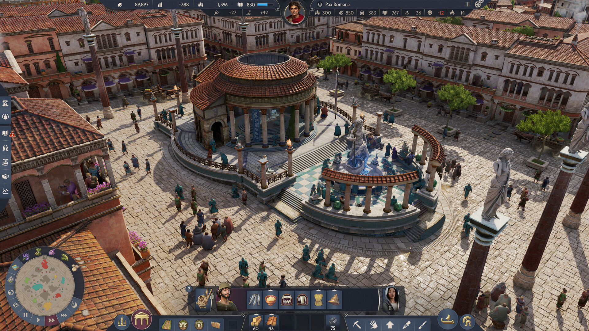
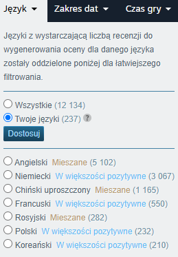
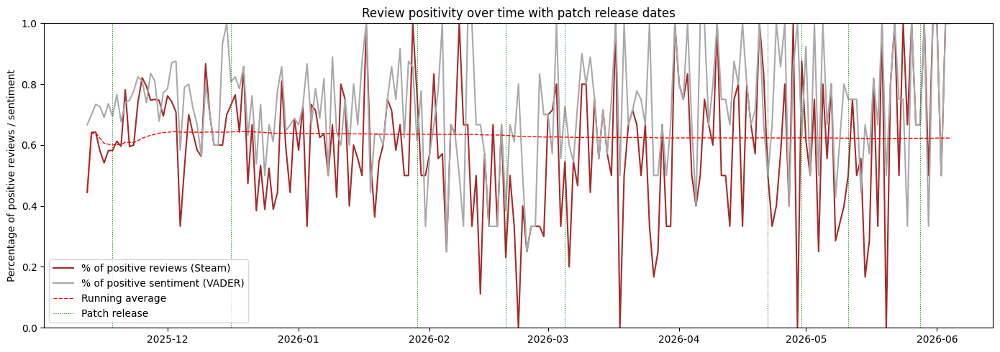
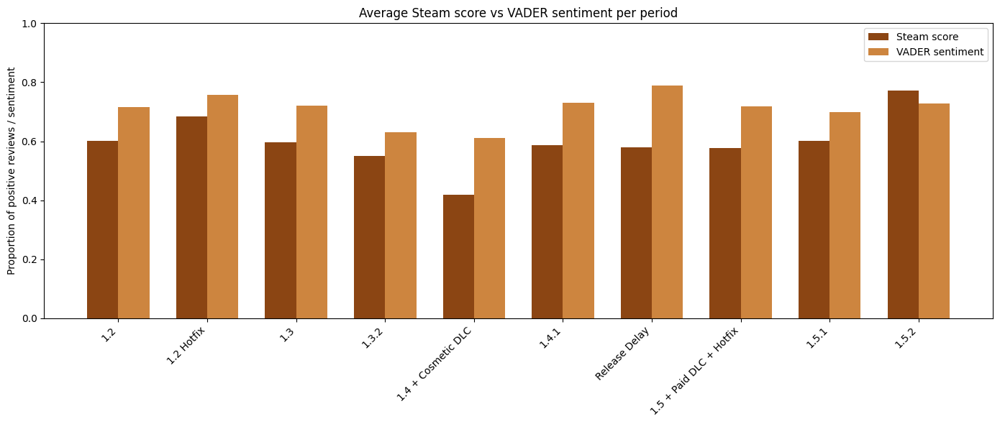
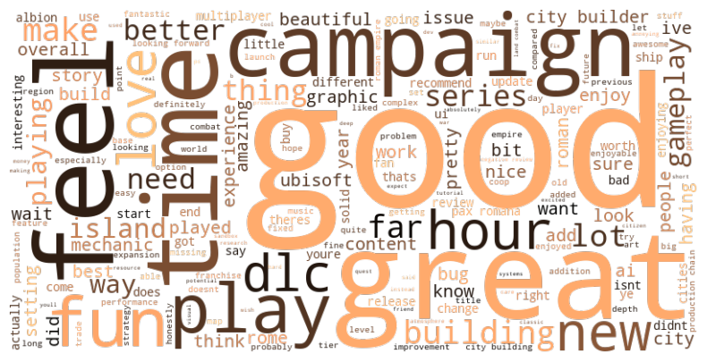
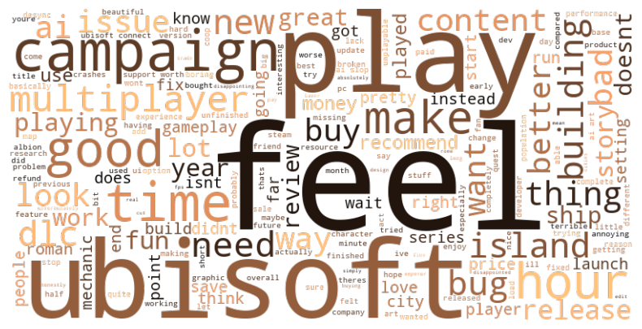
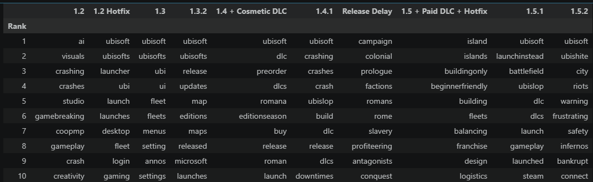

# Sentiment Analysis of Steam Reviews — Anno 117: Pax Romana

A text mining project analysing 4,623 Steam player reviews across seven months of a game's lifecycle, combining VADER sentiment analysis, TF-IDF keyword extraction, LDA topic modelling, and KeyBERT phrase extraction to track how player sentiment evolved with each patch release.

---

## About the Author

This project was completed as part of a text mining course, but the subject matter is far from purely academic.

I have worked for 14 years as a professional video game translator and localisation specialist, translating game content — dialogue, UI, documentation, marketing materials — across dozens of titles. That background shapes this analysis in concrete ways: I can interpret gamer slang, sarcastic review language, and Anno-specific terminology that would be opaque to a general-purpose NLP model. I am also a long-time fan of the Anno series, which means I understand the community's frame of reference when players compare Pax Romana to Anno 1800.

The intersection of localisation expertise and data analysis is not accidental. As the games industry increasingly relies on data-driven decisions, professionals who can bridge domain knowledge with quantitative methods have a distinctive contribution to make — whether in understanding player feedback, evaluating community reception across regions, or informing decisions about post-launch content.

---

## The Game

**Anno 117: Pax Romana** is a city-building strategy game developed by Ubisoft Mainz and published by Ubisoft, released on 13 November 2025 for PC, PlayStation 5, and Xbox Series X|S. Set in the Roman Empire under Emperor Trajan in 117 AD, it is the latest entry in the long-running Anno series, whose previous mainline title — Anno 1800 (2019) — remains one of the highest-rated city-building games on Steam.

The game launched to a mixed reception, with players praising the Roman setting and city-building depth while criticising Ubisoft's DLC pricing practices, AI-generated art assets, multiplayer stability, and the Ubisoft Connect launcher. This mixed reception, combined with a steady stream of patches and announcements over the following months, created an analytically rich dataset for studying how player sentiment shifts in response to specific events.

| | |
|---|---|
|  |  |

*Game images from Anno 117: Pax Romana — Source: Steam*

---

## Business Value of Sentiment Analysis for Games

Player reviews on Steam are one of the most direct, unfiltered signals a game developer or publisher receives from their audience. A game with 5,000 reviews has more qualitative feedback than any focus group — but it is unstructured, noisy, and time-consuming to read manually.

Automated sentiment analysis and keyword extraction provide several concrete business applications:

- **Post-launch monitoring**: Detect sentiment drops immediately after a patch, before they translate into a visible score change, giving the team time to respond.
- **Prioritising bug fixes**: Identify which complaints cluster together and appear most frequently — "multiplayer desync" appearing in 15% of negative reviews in the first two weeks is an actionable signal.
- **DLC and monetisation decisions**: Measure player reaction to new paid content. In this analysis, the introduction of cosmetic DLC in patch 1.4 produced the single sharpest sentiment drop of the entire dataset (to 42.5% positive), providing clear feedback on pricing perception.
- **Reputation management**: Separate complaints about the game itself from complaints about the publisher brand. Here, "Ubisoft" was the single highest-weight term in negative reviews across almost every period — a finding that has implications for how the game is marketed and positioned.
- **Localisation insights**: Cross-language review comparison can reveal whether the game resonates differently in different markets — an area where localisation professionals and data analysts can collaborate productively.

---

## Research Goals

1. Evaluate the performance of **VADER** — a rule-based, training-free sentiment analysis method — on game review data.
2. Identify **key topics and complaints** raised by players in negative reviews.
3. Track how player sentiment and negative themes **evolved across patch release periods**, from launch through Patch 1.5.2.
4. Compare two keyword extraction approaches — **TF-IDF** and **KeyBERT** — for capturing player concerns at different levels of granularity.

---

## Dataset

- **Source**: Steam platform via the official Steam Reviews API
- **Collection tool**: `steamreviews` Python library (`Reviews_ingestion.ipynb`)
- **API parameter**: `language="english"` (intended to filter non-English reviews — see Language Detection below)
- **Raw reviews collected**: 5,268
- **Date range**: 12 November 2025 – 5 June 2026

### After Preprocessing

| Metric | Value |
|--------|-------|
| Total reviews | 4,623 |
| Positive (voted_up = 1) | 62.3% |
| Negative (voted_up = 0) | 37.7% |
| Average review length | 67 words |
| Median review length | 31 words |
| Date range | Nov 2025 – Jun 2026 |

### Preprocessing Steps

- Empty reviews removed (whitespace, NaN, blank strings)
- Reviews shorter than 3 words removed
- Duplicate `review_id` values checked — none found
- `publish_date` converted to datetime; `voted_up` converted to integer (0/1)
- 10 patch periods assigned based on patch release and announcement dates

---

## Language Detection Challenge

Despite using `language="english"` in the Steam API, non-English reviews were present in the dataset. The likely cause is players with incorrectly configured Steam interface language settings.



The most frequent unexpected languages were Somali (114 reviews), German (55), Afrikaans (40), and Norwegian (38). Notably, `langdetect` classifies short, simple English reviews as Somali or Afrikaans due to shared character n-gram patterns — a known limitation of the library on very short texts.

**A memorable edge case**: Anno 117 is set in ancient Rome, and several enthusiastic players wrote reviews in Latin. The library misidentified Latin as Romanian or Catalan (both Romance languages with overlapping n-gram profiles), which required manual review:

> *"Veni, vidi, vici."* → detected as Italian  
> *"Audentes fortuna iuvat"* → detected as Catalan  
> *"Optimus ludus ANNO umquam factus erit; magnus et gloriosus..."* → detected as Catalan

**Solution**: `langdetect` with `DetectorFactory.seed = 42` for reproducibility. Automatically removed: German, Polish, Spanish, Romanian, Chinese. Manually removed: 14 additional reviews (French, Dutch, Slovak, Indonesian, Latin).

---

## Patch Periods

The analysis divides the dataset into 10 periods defined by patch releases and key announcements:

| Period | Date Boundary | Key Event |
|--------|--------------|-----------|
| 1.2 | Launch → 2025-11-18 | Game launch |
| 1.2 Hotfix | → 2025-12-16 | Multiplayer stability hotfix |
| 1.3 | → 2026-01-29 | Performance and crash fixes |
| 1.3.2 | → 2026-02-19 | Additional crash fixes |
| 1.4 + Cosmetic DLC | → 2026-03-05 | First paid DLC (cosmetic) |
| 1.4.1 | → 2026-04-22 | Minor patch |
| Release Delay Announced | → 2026-04-30 | DLC 1.5 delayed announcement |
| 1.5 + Paid DLC + Hotfix | → 2026-05-11 | First story DLC + Hotfix |
| 1.5.1 | → 2026-05-28 | Bug fixes |
| 1.5.2 | Jun 2026 | Latest patch in dataset |

---

## Sentiment Analysis — VADER

VADER (Valence Aware Dictionary and sEntiment Reasoner) is a lexicon-based method designed for short, informal text. It requires no training data and uses a dictionary of ~7,500 words with manually assigned sentiment scores, combined with rules for capitalization, punctuation, negation, and intensifiers.

Two text cleaning functions were used:
- `vader_text`: minimal preprocessing (URLs removed only) — preserves capitalization and punctuation that VADER uses as signals
- `clean_text`: full normalization (lowercase, punctuation removed) — used for TF-IDF, LDA, and KeyBERT

### Classification Results

| Metric | Value |
|--------|-------|
| Accuracy | 0.74 |
| Macro F1 | 0.70 |
| Precision (negative) | 0.70 |
| Recall (negative) | 0.51 |
| F1 (negative) | 0.59 |
| Precision (positive) | 0.75 |
| Recall (positive) | 0.87 |
| F1 (positive) | 0.80 |

VADER performs significantly better on positive reviews (F1: 0.80) than negative (F1: 0.59). Low recall for the negative class (0.51) means approximately half of negative reviews are missed — a relevant limitation for complaint monitoring use cases.

A naive baseline that always predicts "positive" would achieve 62% accuracy, so VADER's 73% represents a meaningful improvement without any task-specific training.

### Lemmatization: No Improvement

Lemmatization using spaCy (POS-aware) was applied to `vader_text` and VADER re-run. Results were identical (accuracy 0.73, macro F1 0.70). VADER's lexicon already contains separate entries for inflected word forms, so normalizing them removes information rather than adding it. All subsequent analysis uses `clean_text` without lemmatization.

---

## Temporal Analysis



*Daily proportion of positive Steam reviews (blue) and VADER sentiment (purple), with running cumulative average (red dashed) and patch period boundaries (green dotted lines)*



*Average Steam review score and VADER sentiment per patch period. Both metrics follow similar trends, with the sharpest drop at the 1.4 + Cosmetic DLC period.*

Key findings from the temporal analysis:

- **No review bombing** detected, despite negative sentiment toward Ubisoft as a brand.
- **Lowest positivity: 1.4 + Cosmetic DLC (42.5%)** — players objected to paid cosmetics they felt should be included in the base game.
- **Highest positivity: 1.2 Hotfix and 1.5.1 (both 68.4%)** — bug-fix patches consistently correlated with sentiment recovery.
- The first paid story DLC (1.5) did not immediately improve sentiment; recovery came with the 1.5.1 bug fixes.

---

## TF-IDF Analysis and Word Clouds

TF-IDF was fitted on all 4,623 reviews. Mean TF-IDF scores per term were computed separately for positive and negative reviews to identify the most characteristic vocabulary of each class.

Custom stop words were added to the standard English stop word list: `anno`, `1800`, `game`, `games`, `like`, `just`, `really`, `im`, `dont` — game-specific high-frequency terms that would otherwise dominate both classes equally.

### Positive Reviews

| Rank | Term |
|------|------|
| 1 | good |
| 2 | great |
| 3 | fun |
| 4 | love |
| 5 | city |
| 6 | beautiful |
| 7 | campaign |
| 8 | roman |
| 9 | hours |
| 10 | building / builder |



### Negative Reviews

| Rank | Term |
|------|------|
| 1 | ubisoft |
| 2 | ai |
| 3 | multiplayer |
| 4 | campaign |
| 5 | feels |
| 6 | bad |
| 7 | bugs |
| 8 | connect |
| 9 | unfinished |
| 10 | dlc |



**Notable finding**: `campaign` appears in both positive and negative top terms — praised for its narrative by satisfied players, criticised for its abrupt ending by dissatisfied ones. This ambivalence is invisible without segmentation by sentiment class.

---

## Number of Reviews per Period


Review volume drops sharply after the launch window. Periods with very few reviews (e.g., Release Delay Announced: 38 reviews; 1.5.1: 19 reviews) produce less reliable per-period averages and were excluded from keyword analysis if they contained fewer than 5 negative reviews.

---

## Per-Period TF-IDF Keywords (Negative Reviews)

TF-IDF was re-fitted on all negative reviews combined (shared vocabulary), then mean scores were computed per period. This design allows direct cross-period comparison of scores.

| Rank | 1.2 | 1.2 Hotfix | 1.3 | 1.3.2 | 1.4 + CDLC | 1.4.1 | Rel. Delay | 1.5 + DLC | 1.5.1 | 1.5.2 |
|------|-----|-----------|-----|-------|-----------|-------|-----------|----------|-------|-------|
| 1 | ai | campaign | campaign | finished | pass | ubisoft | pain | buy | trajan | ubisoft |
| 2 | ubisoft | ai | play | campaign | dlc | better | incomplete | ubisoft | requires | play |
| 3 | multiplayer | ubisoft | multiplayer | content | year | hours | censoring | play | year | connect |
| 4 | play | play | ubisoft | ubisoft | release | dlc | aspects | generated | work | instead |
| 5 | campaign | multiplayer | hours | boring | season | boring | bother | compared | error | time |

The shift in dominant themes is clear: from technical complaints (AI art, multiplayer, bugs) at launch, through DLC pricing concerns, to Ubisoft Connect launcher reliability in the final periods.

---

## KeyBERT Key Phrase Extraction



KeyBERT uses BERT sentence embeddings to find phrases whose semantic representation is closest to the overall document embedding — capturing meaning rather than just frequency. It was applied to negative reviews per period, complementing the TF-IDF analysis.

Key observations:
- Both methods consistently identified **Ubisoft Connect** and **AI art** as the dominant complaints.
- KeyBERT surfaced specific phrases like *"ubisofts infrastructure notoriously flaky"* and *"ubisoft connect ruined fun"* that single-word TF-IDF cannot capture.
- The evolution of AI art criticism in slang form — from **"ubislop"** (1.4.1) to **"ubishite"** (1.5.2) — illustrates how community language hardens over time as frustration builds.
- KeyBERT's top 40 phrases across the full corpus were dominated by variations of "ubisoft connect bad", confirming that strong topic dominance limits phrase diversity.

---

## LDA Topic Modelling

Latent Dirichlet Allocation was applied separately to all reviews, positive reviews, and negative reviews (5 topics each). Selected topics from negative reviews:

| Topic | Top Words |
|-------|-----------|
| DLC / monetisation | dlc, content, pass, ubisoft, release, year, money, paid |
| Ubisoft Connect | ubisoft, multiplayer, connect, hours, time, work, desync, fix |
| City-building mechanics | city, new, island, build, buildings, need, roman |
| Campaign narrative | campaign, feels, story, hours, ends, short, price |
| AI art controversy | ai, art, ubisoft, slop, artists, ai art, generated |

---

## Methods Summary

| Method | Purpose | Library |
|--------|---------|---------|
| langdetect | Language identification and filtering | `langdetect` |
| VADER | Sentiment classification | `nltk` |
| spaCy | Lemmatization (comparison experiment) | `spacy` |
| TF-IDF | Term importance, keyword extraction | `scikit-learn` |
| WordCloud | Vocabulary visualisation | `wordcloud` |
| LDA | Unsupervised topic modelling | `scikit-learn` |
| KeyBERT | Semantic key phrase extraction | `keybert` |

---

## Repository Structure

```
.
├── sentiment_analysis.ipynb   # Main analysis notebook
├── Reviews_ingestion.ipynb    # Data collection via Steam API
├── steam_reviews_3274580.csv  # Raw review dataset
├── anno_117_pax_romana_patches.csv  # Patch dates and descriptions
├── pyproject.toml             # uv project dependencies
└── *.png / *.jpg              # Charts and game images
```

## Setup

This project uses [uv](https://github.com/astral-sh/uv) for dependency management.

```bash
uv sync
uv run jupyter notebook
```

To download the spaCy English language model after setup:

```bash
.venv\Scripts\python.exe -m spacy download en_core_web_sm
```

---

## Key Findings

1. **VADER achieves 74% accuracy** (macro F1: 0.70) on Steam game reviews with no task-specific training — a reasonable baseline for unsupervised complaint monitoring.
2. **Main failure modes**: concessive structures ("great, but…"), sarcasm, idiomatic expressions, and neutral wish-list language.
3. **Lemmatization does not help** VADER on English game reviews.
4. **Ubisoft brand sentiment** is the single strongest signal in negative reviews, independent of game quality in specific periods.
5. **Paid cosmetic DLC caused the sharpest sentiment drop** (42.5% positive), while bug-fix patches consistently correlated with recovery.
6. **Player concerns shifted predictably** over 7 months: technical bugs at launch → DLC pricing → launcher reliability — a coherent narrative that raw score averages alone would not reveal.
7. **Steam labels are imperfect ground truth**: some reviews with a positive vote contain predominantly negative text, suggesting that qualitative analysis adds signal beyond the binary thumbs up/down.

---

*Game images © Ubisoft. Source: Steam store page for Anno 117: Pax Romana.*
